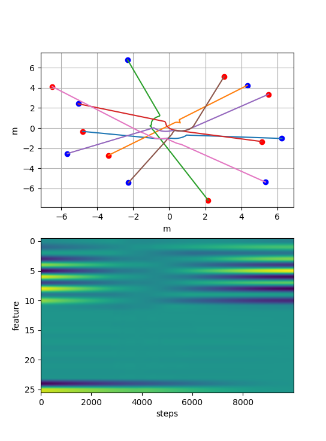
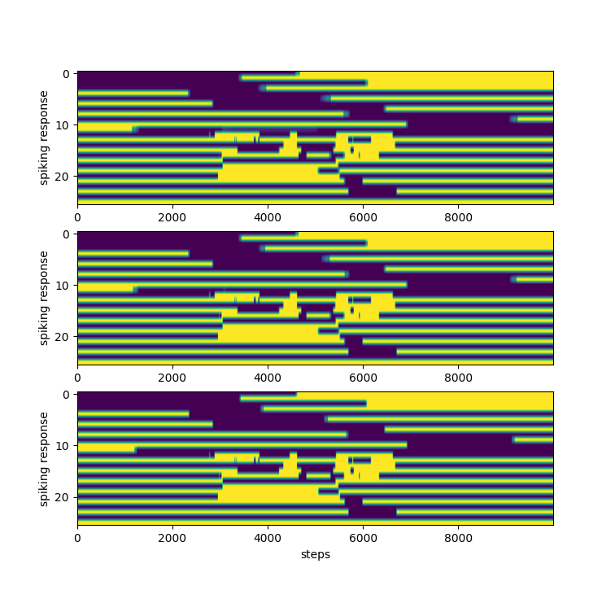

  


# Neuromorphic collision avoidance :brain: :robot: 


This repo contains the code developed to simulate a collision event among a group of 7 robots. The robots considered are the holonomic nexus platforms. Six of the robots are controlled in velocity by a PD type of controller which drives the robot from a start to a goal position. Additionally each robot is running a Control Barrier Function enabled safety filter that projects the velocity input given by the PD controller into the manifold of safe control input that avoid collisions with the other agents in the system. one of the robot is instead controller via a spiking neural network controller which is trained beforehand via `torch` and  `norse`.

Broadly speaking, a spiking neural network resamble a classic recurrent neural network whereby each neuron is endowed with a state (the membrane voltage of the neuron). Upon excitement, the memebrane voltage of the neuron increases following the dynamics


$$\dot{v} = 1/\tau_{\text{mem}} (v_{\text{leak}} - v + i),$$

where $v_{leak}$ represents a potential leakage, $i$ is the input current to the neuron and $\tau_{mem}$ is a constant of integration controlling the "speed" of the voltage dynamics.

 
The dataset for the traning is composed of 250 simulations as the one shown below. namely, 7 agents are set on a collision path among each other with randomized intiial and final conditions. A single training instance for the Spiking Neural Network is given by the time evolution of a 26 dimensional feature vector that contains : The relative position of the goal, the relative position to eah other agent and the relative velocity of each other agent. The label to be learned is the control input in velocity (thus 2 dimension) for each time step. 



During training, the feature trajectory is converted into a spikes from the spiking neural network as can be seen in the images below. Three spiking profiles are obtained from one single input feature trajectory as to capture different temporal behaviors




After the three spiking responses are obtained, a convolutional layer makes an average to bring them to one single tensor of dimension 26x(steps) and a final linear later bring the tensor in the velocity space producing a tensor of dimension 2x(steps).

After training the network can be deployed!

:) happy coding! :)

## Requirements
The python requirements to run the repo are stored in the `requirement.txt` file. You can install the requirements globally or via virtual environment. For the visualization Gazebo is used together with ROS2 humble.

you can install the version of gazebo recommended for the humble distributiin by running the command from the [gazebo documentation](https://gazebosim.org/docs/latest/ros_installation/)

```
sudo apt-get install ros-humble-ros-gz
```
The package was developed for the ROS2 `humble` distribution. No other distribution was tested.

## Installation

To install the ros package you need to install the recommended simulations packages first. First create a repo for your workspace 

```
mkdir -p neuromorphic_ws/src
```
enter the src directory and clone all the required dependencies
```
cd neuromorphic_ws/src

git clone https://github.com/gregoriomarchesini/sml_nexus_plugin_ros2.git
git clone https://github.com/gregoriomarchesini/sml_nexus_description_ros2.git
git clone https://github.com/gregoriomarchesini/sml_nexus_tutorials_ros2.git
```
also install this package in the `src` directory

```
git clone https://github.com/gregoriomarchesini/neuromorphic_collision_avoidance.git
```

You are now ready! At the last steps build the workspace and install the required dependencies using rosdep

```
cd ..
rosdep install --from-paths ./src --ignore-src -r -y
colcon build --symlink-install  
source install/setup.sh
```
the dependency from the package `norse` needs to be resolved manually using `pip`. So install norse on the python globally on your your machine by running 
```
pip install norse
```
If during the build process you see the warning 

```
/usr/lib/python3/dist-packages/setuptools/command/easy_install.py:158: EasyInstallDeprecationWarning: easy_install command is deprecated. Use build and pip and other standards-based tools.
  warnings.warn(
```
this is a known issue in ROS2 humble. Everything will run smoothly.


In case you are using a virtual environment instead follow the instructions on the `ros2` documentation [here](https://docs.ros.org/en/foxy/How-To-Guides/Using-Python-Packages.html)


You can now run the simulation
```
ros2 launch neuromorphic_collision_avoidance gazebo_multi_agent.launch.py
```

## License
This package is distributed under the Apache License 2.0.

## Authors
Gregorio Marchesini gremar@kth.se.

